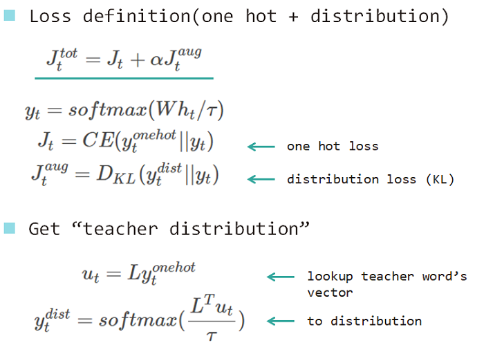

# Tying Word Vectors and Word Classifiers: A Loss Framework for Language Modeling

Implementation for "[Tying Word Vectors and Word Classifiers: A Loss Framework for Language Modeling](https://arxiv.org/abs/1611.01462)"

## Summary of Paper

### Motivation

In the language modeling, we want to express the likelihood of the word. Ordinary one-hot vector teaching is not suitable to achieve it. Because any similar words ignored, but the exact answer word.

### Method

So we use "distribution of the word" to teach the model. This distribution acquired from the answer word and embedding lookup matrix.

If we use this distribution type loss, then we can prove the equivalence between input embedding and output projection matrix.

To use the distribution type loss and input embedding and output projection equivalence restriction improves the perplexity of the model.

## Experiments

### Implementation

* [Keras](https://github.com/fchollet/keras): to implements model
* [chazutsu](https://github.com/chakki-works/chazutsu): to download Dataset

### Result

* By the quick/small corpus experiment, I confirmed strong regularization effect by using proposed method.
  * `augmentedmodel` and `augmentedmodel_tying` outperforms the baseline (`onehotmodel`)!
* Temperature affects training speed (is this the trade-off of training and regularization?)
* (I could not confirm the suppression of quantifier (like `a`, `the`)).
* You can run this experiment by `python tests/evaluation.py`

* But when using Penn Treebank dataset, augmented & tying model needs much more time to exceed the baseline (LSTM).
* I set `--skip 3` to reduce the dataset size. This may affect this result (augmented loss calculation takes cost because it requires multiplication with embedding matrix (large size matrix), so training speed is a little bit slow).
* You can run this experiment by `python train.py`

## Hypothesis

* At the beginning of the training, embedding matrix to produce "teacher distribution" is not trained yet. So proposed method has a handicap in the first phase.
* So to increase temperature (alpha) gradually will improve training speed.
* To use the pre-trained word vector, fix the embedding matrix weight for some interval (fixed target technique at the reinforcement learning (please refer [*Deep Reinforcement Learning*](http://www.iclr.cc/lib/exe/fetch.php?media=iclr2015:silver-iclr2015.pdf))) will also improve the training.

**By the way,  [PyTorch example already use tying method](https://github.com/pytorch/examples/blob/1c6d9d276f3a0c484226996ab7f9df4f90ce52f4/word_language_model/model.py#L28)! Don't be afraid to use it!**
