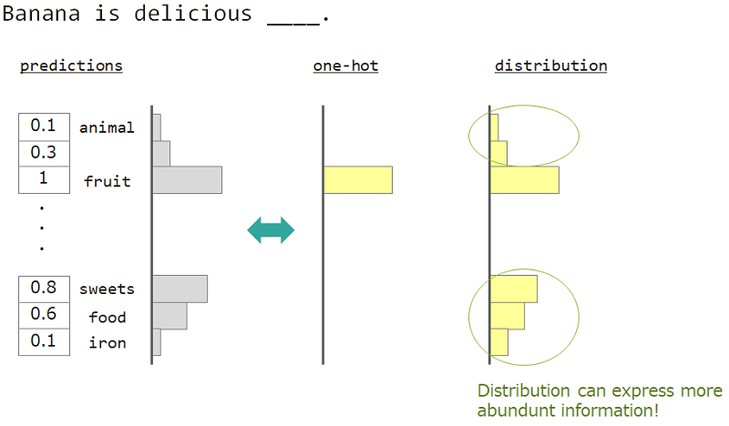
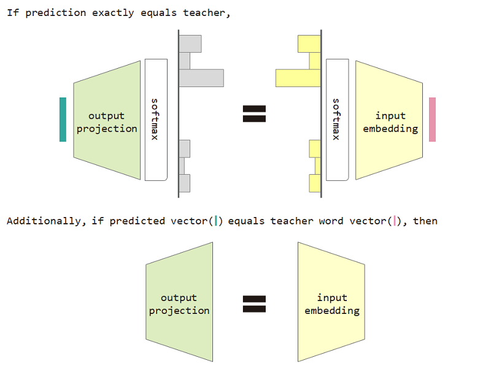

# Tying Word Vectors and Word Classifiers: A Loss Framework for Language Modeling

Implementation for "[Tying Word Vectors and Word Classifiers: A Loss Framework for Language Modeling](https://arxiv.org/abs/1611.01462)"

## Summary of Paper

### Motivation

In the language modeling, we want to express the likelihood of the word. Ordinary one-hot vector teaching is not suitable to achieve it. Because any similar words ignored, but the exact answer word.

### Method

So we use "distribution of the word" to teach the model. This distribution acquired from the answer word and embedding lookup matrix.

If we use this distribution type loss, then we can prove the equivalence between input embedding and output projection matrix.

To use the distribution type loss and input embedding and output projection equivalence restriction improves the perplexity of the model.

## Experiments

### Implementation

* [Keras](https://github.com/fchollet/keras): to implements model
* [chazutsu](https://github.com/chakki-works/chazutsu): to download Dataset

### Result

Now comming
